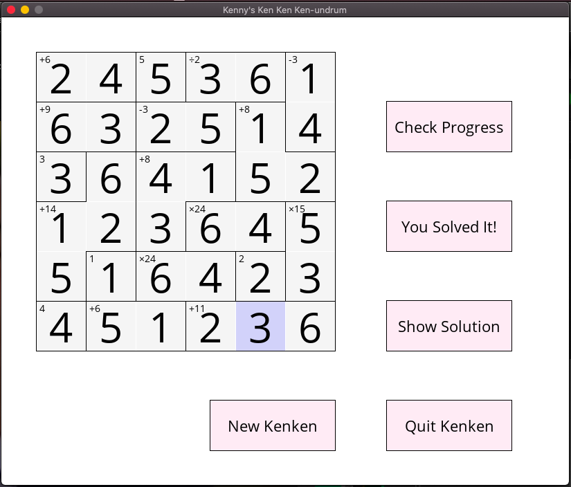
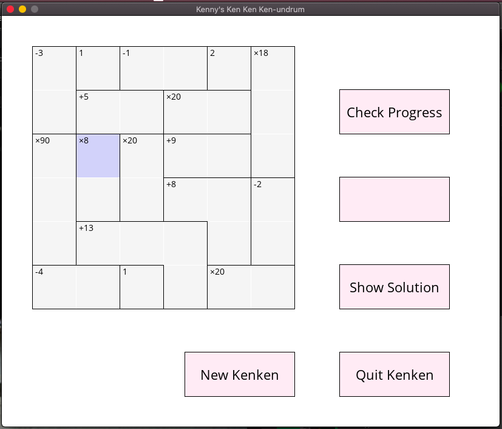
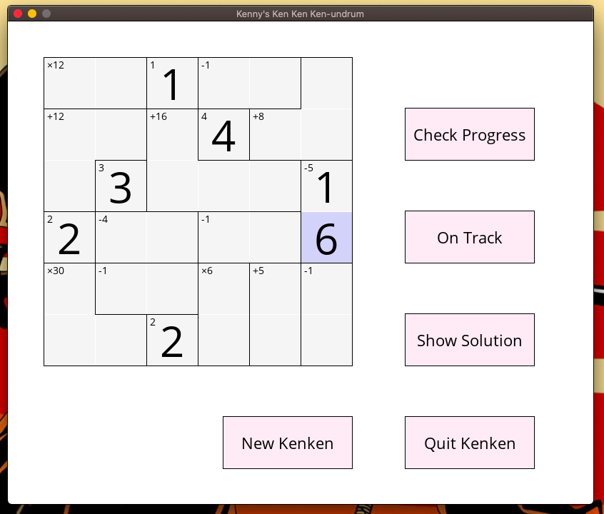

Kenken:

A simple GUI program that allows the user to play a 6x6 kenken game.

To install:

Ensure that SDL2 and SDL_ttf are installed on your system. See https://www.libsdl.org/ and https://www.libsdl.org/projects/SDL_ttf/ for more info.

Clone this repository, and run "make all". This will create an executable "kenken".

Context: This game was made entirely for my own development as a programmer, and is definitely still a work in progress. It began as an excuse to implement linked lists in C, as I figured that, since each constraint could be a different size, a linked list was an appropriate data structure. However, as I progressed, it began to take on its own life. 

As it developed, I had the chance to develop my skills developing a mid-sized c program, learnt about many particularities of pointers, memory allocation, arrays and functions that have massively improved my programming abilities. I also got to work with doubly-linked lists, 3rd party libraries, events, and a huge variety of C data structures. 

There are some features that I would still like to add, in particular with regards to saving and loading, and also with regards to changing the size of the kenken, but for now I am happy with the state of the program.

Features:

- Kenken Generator:

-- Generates a random grid of numbers, with no repeats in any row or column
-- Randomly generates a constraint, which uses a random walk algorithm ensure that the constraint is connected
-- Contains programs to check the validity of a kenken or a single constraint
-- After all constraints are generated, the kenken is checked with the solver to have a unique solution

- Kenken Solver:

-- A simple solver that creates an array of possible solutions for each square of the kenken, and then trims this as much as possible using the initial conditions of the kenken (checking against rows, columns and individual constraints), before brute forcing any remaining unsolved sections of the kenken
-- This component also stores the first solution it finds, and checks the kenken to determine if there are any other solutions
-- The brute force algorithm uses a recursive algorithm which fills in a square with an available number, then, if the puzzle is solved, returns success, else it calls the algorithm on the next square. If no solution can be found, it returns a failure, which is passed to the preceeding square, which eliminates its previous selection from its list of available choices. NOTE: This is an approximate description, there is further complexity in the real implementation.

- GUI:

-- A simple main loop GUI, which stores the user game data and draws it the screen, giving the user a solvable puzzle
-- The user can enter numbers into this puzzle, can check their progress, delete entries, see the solution, or generate a new kenken
-- Implemented with SDL2 and SDL_ttf

- Save/Load:

-- NOT IMPLEMENTED IN THE MAIN LOOP
-- A simple savegame functionality which can take users kenken and save it as a text file
-- A load function has been written which parses the text file, and if it is a valid kenken, populates a kenken pointer with the data from said file
-- Still needs some work to allow the user to use these functions to save a game from the program

- Screenshots:

